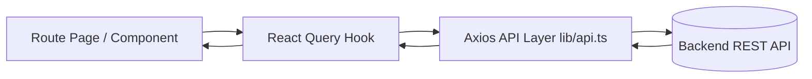
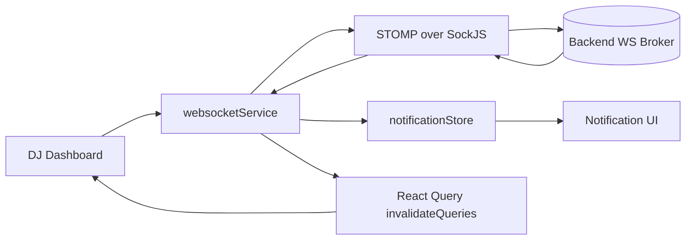

# TipTune Frontend Architecture

This document is the technical handoff for continuing development in this frontend.

## 1. System Overview

The app is a Next.js 14 App Router frontend with a mostly client-rendered architecture:

1. UI and route layer: `app/*`
2. API and domain layer: `lib/api.ts`, `lib/types.ts`
3. Caching and async state layer: React Query in `app/providers.tsx`
4. Realtime layer: STOMP/SockJS in `lib/websocket.ts`
5. Local UI state layer: Zustand in `store/notificationStore.ts`
6. Shared component and UX layer: `components/*`

## 2. Runtime Data Flow

## 3. Realtime Flow

## 4. Project Structure

| Path | Responsibility |
|---|---|
| `app/layout.tsx` | root layout, metadata, global providers |
| `app/providers.tsx` | React Query client config |
| `app/page.tsx` | marketing landing page |
| `app/login/page.tsx` | login flow |
| `app/register/page.tsx` | registration flow |
| `app/dashboard/*` | role-specific dashboards |
| `app/event/[accessToken]/page.tsx` | public event request/tip flow |
| `app/tip/[token]/page.tsx` | permanent tip flow |
| `lib/api.ts` | all HTTP API calls + interceptors |
| `lib/websocket.ts` | realtime subscriptions and socket lifecycle |
| `lib/roleGuard.ts` | role route rules and redirects |
| `store/notificationStore.ts` | notifications state |
| `components/export/*` | QR/Report export (PNG/PDF/CSV) |
| `components/notifications/*` | bell, panel, toast, list items |

## 5. Routing and Access Model

### Public routes

1. `/`
2. `/login`
3. `/register`
4. `/events`
5. `/events/[id]`
6. `/event/[accessToken]`
7. `/tip/[token]`

### Protected routes

1. `/dashboard/user` for `USER`
2. `/dashboard/dj` and `/dashboard/dj/analytics` for `DJ` or `ARTIST`
3. `/dashboard/admin` for `SUPER_ADMIN`

### Guarding behavior

1. Client-side role guards run in pages using `getCurrentUser()` + `shouldRedirect(...)`.
2. `/dashboard` resolves to role destination using `getDashboardPath(...)`.
3. API 401 handler clears auth and redirects to `/login`.

## 6. Auth and Session Mechanics

1. JWT token is stored in `localStorage` key `token`.
2. User object is stored in `localStorage` key `user`.
3. Axios request interceptor attaches `Authorization: Bearer <token>`.
4. Axios response interceptor handles non-auth 401 by logout and redirect.
5. `useMounted()` is used on auth-sensitive pages to avoid hydration mismatch.

## 7. API Layer Design

`lib/api.ts` contains:

1. Base URL resolution with local-network override for phone testing.
2. Typed API namespaces:
3. `authApi`
4. `djApi`
5. `userApi`
6. `eventApi`
7. `songRequestApi`
8. `publicTipApi`
9. `adminApi`

Main domain types are in `lib/types.ts`.

## 8. Query and Cache Strategy

Configured in `app/providers.tsx`:

1. `staleTime`: 5 min default
2. `gcTime`: 10 min default
3. `refetchOnWindowFocus`: false
4. retries disabled for 4xx

Common query keys:

| Feature | Query keys |
|---|---|
| DJ events | `['dj-events']` |
| DJ requests | `['dj-requests', eventId, filter, sort]` |
| DJ tip settings | `['dj-tip-settings']` |
| DJ tip-only records | `['dj-tip-records']` |
| DJ revenue summary | `['dj-revenue-summary', from, to]` |
| DJ top songs | `['dj-top-songs', from, to]` |
| Admin analytics | `['admin-analytics', from, to]` |
| Admin users | `['admin-users', page, role]` |
| Admin events | `['admin-events', page, status, from, to]` |
| Admin requests | `['admin-requests', page, status, from, to]` |
| Admin revenue by DJ | `['admin-revenue-by-dj', from, to]` |
| Admin revenue series | `['admin-revenue-series', ...filters]` |
| Admin top songs | `['admin-top-songs', ...filters]` |
| Public event | `['event', accessToken]` |
| Event details by id | `['event', eventId]` |

Mutation success generally invalidates related keys instead of manual deep cache edits.

## 9. Core Feature Mechanics

### DJ dashboard (`app/dashboard/dj/page.tsx`)

1. Event CRUD and lifecycle (active/end/delete).
2. Request moderation (accept/decline/played).
3. Event QR fetch as blob URL and export via `QRDownload`.
4. Permanent tip link and tip settings management.
5. Revenue mini-analytics and CSV export.
6. Notification bell/panel/toast integration.
7. WebSocket subscriptions for:
8. event requests
9. event revenue updates
10. DJ-level notifications

### Admin dashboard (`app/dashboard/admin/page.tsx`)

1. Analytics overview cards and charts.
2. Users/events/requests tabs with pagination + filters.
3. Revenue analytics tab:
4. revenue-by-DJ table
5. histogram
6. top songs
7. fullscreen overlays reusing existing fetched data
8. report export from currently loaded datasets

### Public event flow (`app/event/[accessToken]/page.tsx`)

1. Loads public event by token.
2. User chooses `tip_only` or `request_song`.
3. Optional tip amount and payer metadata.
4. Handles blocked events (`ENDED`, `DEACTIVATED`).
5. For tipping: records tip first, then triggers USSD dial (`tel:`).

### Permanent tip flow (`app/tip/[token]/page.tsx`)

1. Fetches tip target details from token.
2. Accepts amount and optional payer details.
3. Records tip via API.
4. Redirects to USSD dial flow.

## 10. Performance Techniques Used

1. React Query cache windows tuned per page.
2. Debounced, abortable music search (`components/music/MusicSearchInput.tsx`).
3. Client memory cache for search results (`lib/musicApi.ts`).
4. Component memoization for high-repeat list items.
5. Progressive list rendering via "Show more" in request-heavy screens.
6. Mostly CSS-transform animations to keep motion cheap.
7. No unnecessary report refetching; exports use already-loaded data.

## 11. Security Posture and Risks

### Existing protections

1. Token attached to API calls.
2. 401 session invalidation.
3. Role-aware route redirects.
4. Input validation for amounts/codes/date ranges on client.

### Risks to track

1. `localStorage` token is vulnerable to XSS token theft.
2. Middleware does not enforce server-side auth/role checks for dashboard paths.
3. Some QR generation relies on external `api.qrserver.com` URL, leaking tip-link data to third party.
4. UI role checks are not security boundaries; backend authorization must remain strict.

## 12. Extension Playbook

When adding a new feature:

1. Define/update DTOs in `lib/types.ts`.
2. Add API calls in `lib/api.ts` under the right namespace.
3. Add React Query hook usage in route/component.
4. Pick stable query keys and mutation invalidation strategy.
5. Add realtime subscriptions in `lib/websocket.ts` only if truly needed.
6. Reuse shared components from `components/ui/*` and `components/export/*`.
7. Add mobile behavior alongside desktop behavior.

## 13. Safe Refactor Priorities

1. Move auth token to secure HttpOnly cookie model.
2. Add true server-side route enforcement for protected pages.
3. Consolidate repeated DJ tip-link QR blocks into one reusable component.
4. Normalize revenue/date formatting in one utility layer.
5. Extract DJ dashboard sections into smaller feature components to reduce file size.

## 14. Quick Troubleshooting

1. Blank protected page after login:
2. check `localStorage` keys `token` and `user`
3. check role mismatch in `roleGuard.ts`
4. API calls failing on mobile LAN:
5. verify `NEXT_PUBLIC_API_URL` and local network host mapping logic in `lib/api.ts`
6. Realtime not updating:
7. check `NEXT_PUBLIC_WS_URL`
8. verify subscription topics and backend broker paths
9. Tip dial not opening:
10. test on real mobile device, desktop browsers only show `tel:` fallback behavior

