# TipTune Frontend Deep Dive

This is the implementation-level continuation guide for this frontend.

## 1. How To Read This

1. Start with `ARCHITECTURE.md` for the big picture.
2. Use this file when changing a specific feature.
3. Follow each feature’s “Safe modification checklist” before shipping.

## 2. App Boot Sequence

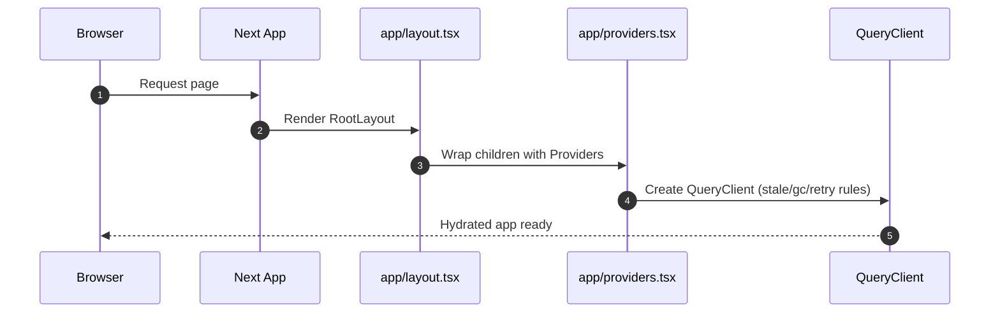

Key files:

1. `app/layout.tsx`
2. `app/providers.tsx`

## 3. Auth and Role Routing Deep Dive

### 3.1 Login flow sequence

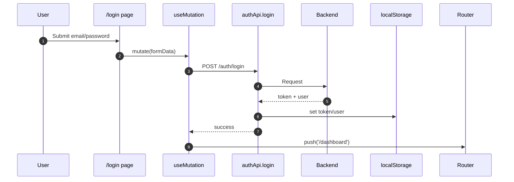

### 3.2 Dashboard role redirection sequence

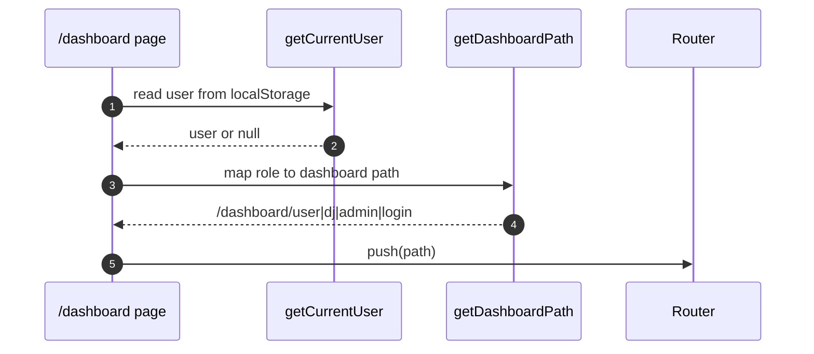

Safe modification checklist:

1. Keep auth writes centralized in `authApi.login/register`.
2. Do not duplicate token parsing logic in page components.
3. If adding roles, update:
4. `lib/types.ts` Role enum
5. `lib/roleGuard.ts`
6. dashboard route redirects and UI labels

## 4. API Layer Deep Dive

Core principles in `lib/api.ts`:

1. Single Axios instance for authenticated app requests.
2. Request interceptor for bearer token.
3. Response interceptor for 401 handling and error message extraction.
4. Namespace-style API functions per domain.

### 4.1 401 handling sequence

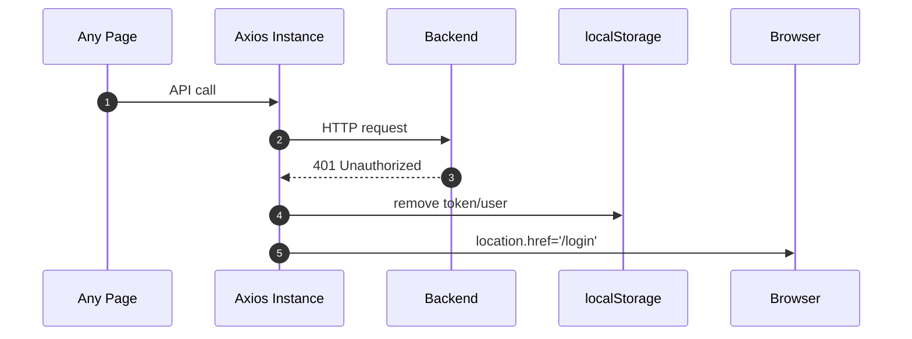

Safe modification checklist:

1. Add new endpoints to existing namespaces where possible.
2. Keep request/response typing in `lib/types.ts`.
3. Do not bypass the shared Axios instance for protected calls.
4. For public endpoints, document clearly why they bypass auth.

## 5. React Query Strategy Deep Dive

### 5.1 Mutation invalidation pattern

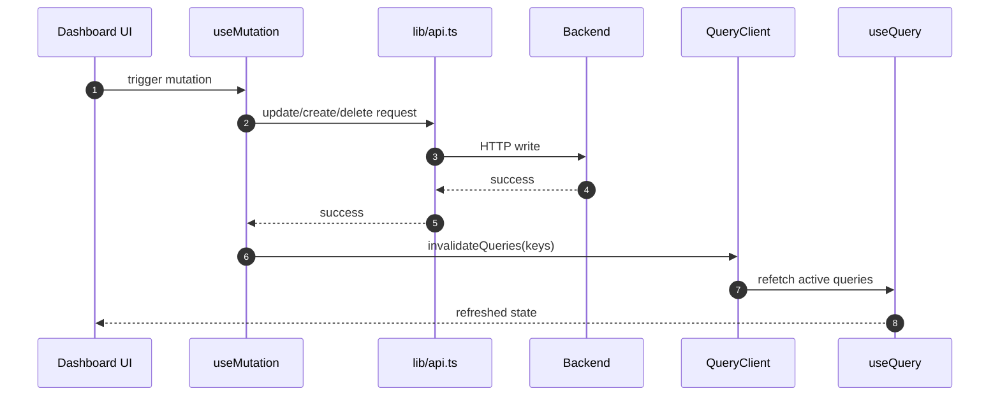

Safe modification checklist:

1. Use stable query keys with parameterized tuples.
2. Invalidate only related keys to avoid unnecessary network load.
3. Prefer invalidation over manual deep cache mutation unless required.
4. Keep stale/gc values intentional per feature.

## 6. DJ Dashboard Deep Dive

Main file: `app/dashboard/dj/page.tsx`.

### 6.1 Event management sequence

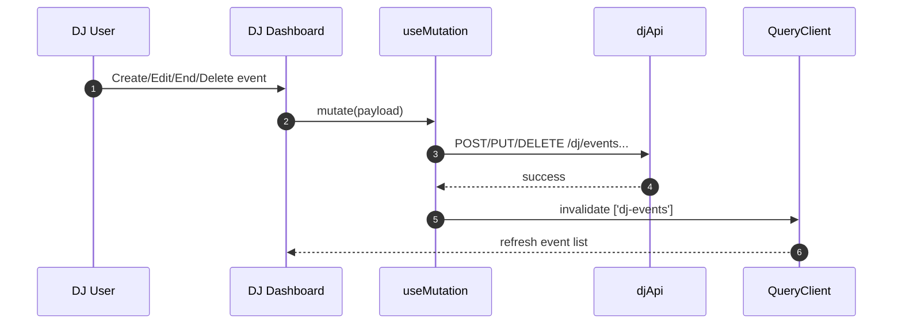

### 6.2 Request moderation sequence

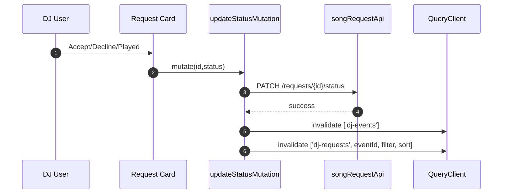

### 6.3 Tip settings and permanent tip link sequence

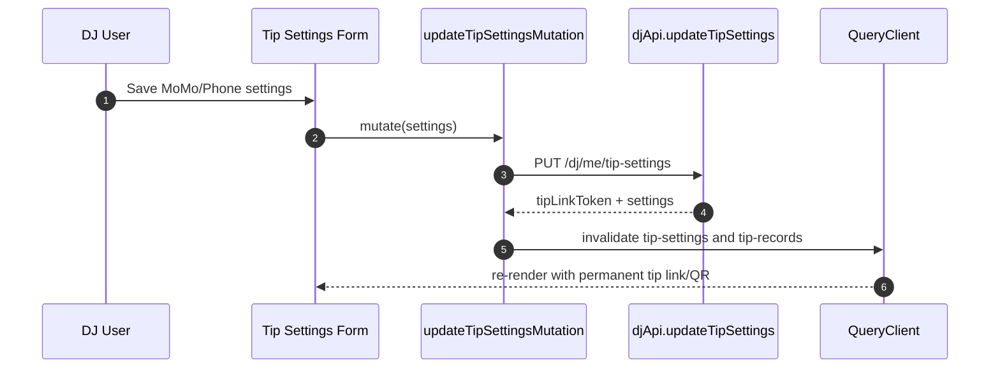

Safe modification checklist:

1. Keep event validation consistent:
2. start >= now
3. end > start
4. Keep tip code numeric sanitation rules aligned with backend contract.
5. Reuse existing keys:
6. `['dj-events']`
7. `['dj-requests', selectedEventId, apiFilter, requestSort]`
8. `['dj-tip-settings']`
9. `['dj-tip-records']`
10. `['dj-revenue-summary', from, to]`

## 7. Realtime and Notifications Deep Dive

### 7.1 Event request subscription sequence

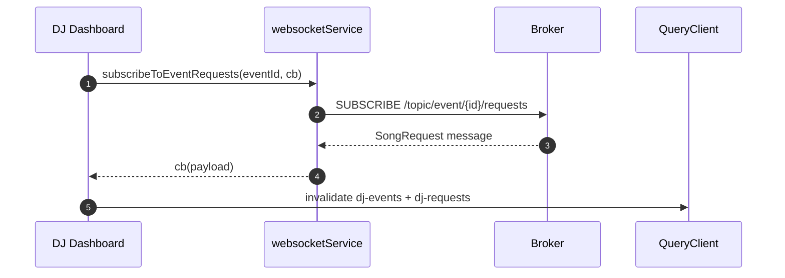

### 7.2 DJ notifications sequence

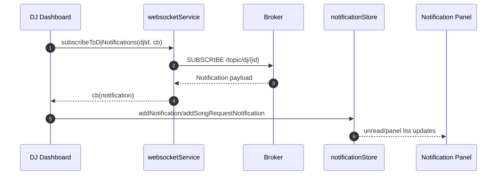

Safe modification checklist:

1. Always unsubscribe in effect cleanup.
2. Avoid duplicate subscriptions by guarding connection state.
3. Keep topic naming conventions consistent with backend.
4. For new notification types, extend `Notification` type safely in `lib/types.ts`.

## 8. Admin Dashboard Deep Dive

Main file: `app/dashboard/admin/page.tsx`.

### 8.1 Tab-driven fetch behavior

Only fetches heavy tab data when tab is active:

1. users tab fetches users query
2. events tab fetches events query
3. requests tab fetches requests query
4. revenue tab fetches revenue datasets

This is controlled by `enabled` conditions in each `useQuery`.

### 8.2 Revenue analytics sequence

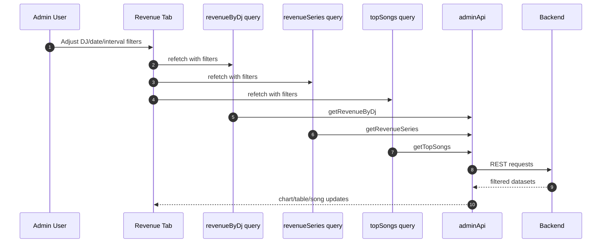

Safe modification checklist:

1. Keep analytics filters synchronized with query keys.
2. Do not enable heavy queries outside active tab unless needed.
3. Reuse `FullScreenOverlay` without triggering extra refetches.

## 9. Public Event and Tip Flows Deep Dive

Main files:

1. `app/event/[accessToken]/page.tsx`
2. `app/tip/[token]/page.tsx`

### 9.1 Public request with optional tip sequence

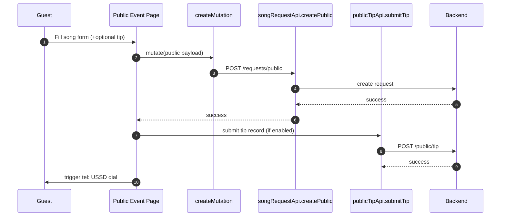

### 9.2 Tip-only page sequence

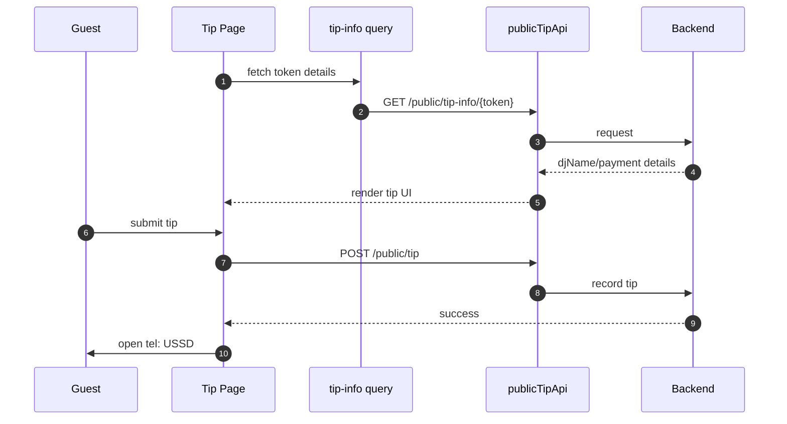

Safe modification checklist:

1. Keep event blocked-state handling consistent with backend statuses.
2. Keep amount bounds synchronized with backend validation.
3. Never trigger payment redirect when tip record submission fails.

## 10. Export System Deep Dive

Files:

1. `components/export/QRDownload.tsx`
2. `components/export/ReportExport.tsx`

### 10.1 QR export behavior

1. Accepts `data:` or `blob:` URL.
2. Converts blob URL to data URL for PDF embedding.
3. Supports PNG and PDF download.

### 10.2 Report export behavior

1. CSV built from title + generated timestamp + summary + tables.
2. PDF built with `jsPDF` + `jspdf-autotable`.
3. Uses currently available in-memory data.

Safe modification checklist:

1. Keep generated export data deterministic and typed.
2. Avoid hidden backend calls during export unless explicitly needed.
3. Keep filename conventions human-readable and traceable.

## 11. UI Component Patterns

1. `GlassCard` for most containers.
2. `GlowButton` wraps shared button variants with motion.
3. `ResponsiveTable` for desktop table + mobile cards.
4. `MobileDrawer` for mobile navigation panels.
5. `FullScreenOverlay` for analytics expansion.
6. `DatePicker` and `DateTimePicker` for date inputs.

Safe modification checklist:

1. Reuse these components before creating new variants.
2. Preserve accessibility labels and keyboard interactions.
3. Keep mobile tap-target sizes (`min-h-[44px]`) intact.

## 12. Cross-Cutting Constraints

### 12.1 Hydration safety

Use `useMounted()` when rendering logic depends on:

1. `window`
2. `localStorage`
3. client-only APIs

### 12.2 Date/time formatting

Use shared format helpers from `lib/utils.ts`:

1. `formatInRwanda`
2. `formatDateInRwanda`
3. `formatTimeInRwanda`

### 12.3 Error normalization

Use `getApiErrorMessage` (`lib/apiClient.ts`) for user-facing error copy consistency.

## 13. Known Technical Debt

1. Very large page files:
2. `app/dashboard/dj/page.tsx`
3. `app/dashboard/admin/page.tsx`
4. client-only auth guard approach should be strengthened server-side.
5. repeated tip-link QR rendering logic appears in multiple DJ layout branches.

## 14. Suggested Refactor Plan (Low Risk First)

1. Extract DJ page sections into focused components:
2. `DjHeader`
3. `DjEventSidebar`
4. `DjRequestsPanel`
5. `DjTipSettingsCard`
6. `DjRevenuePanel`
7. Extract Admin analytics blocks into reusable section components.
8. Create a shared `TipLinkQrCard` component.
9. Move auth to cookie model once backend supports it.

## 15. PR Checklist For Future Changes

1. Types updated in `lib/types.ts`.
2. API contract added in `lib/api.ts`.
3. Query keys stable and invalidation correct.
4. WebSocket cleanup added if subscription introduced.
5. Mobile and desktop behavior both verified.
6. Error state and loading state handled.
7. Security impact reviewed:
8. auth boundary
9. data exposure
10. third-party calls
11. Export behavior verified if reporting/tip/QR changed.

